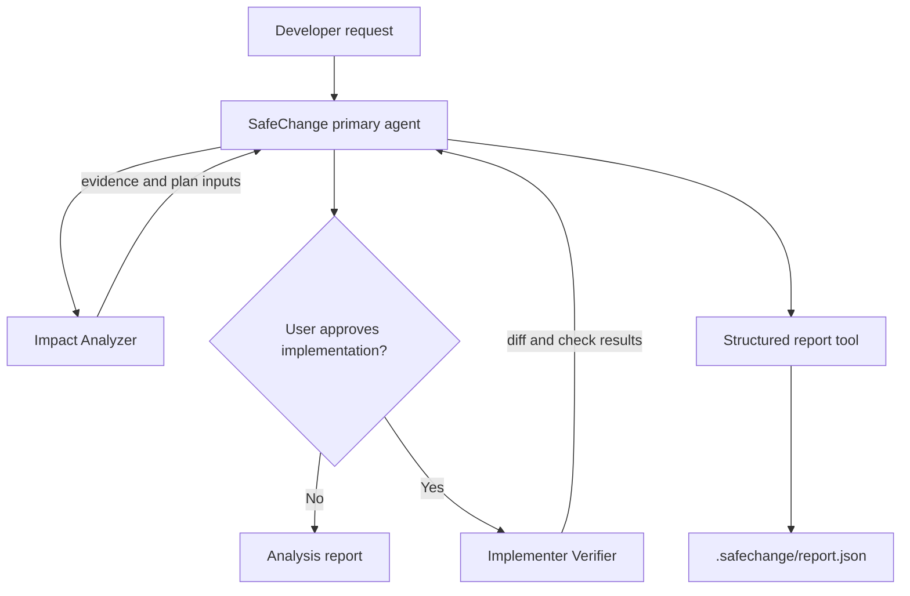

# Architecture

SafeChange separates orchestration, evidence gathering, mutation, and
verification so that each capability has a narrow responsibility and permission
boundary.

## Components

### Primary agent

The primary agent owns the lifecycle and user interaction. Its task permission
only allows the two bundled subagents, preventing uncontrolled delegation.

### Impact Analyzer

The analyzer is read-only. It maps repository structure and uses LSP plus textual
search to build an evidence-backed impact set. Git commands are restricted to
status, diff, and tracked-file inspection.

### Implementer Verifier

The implementer receives an approved, bounded plan. It can edit repository files,
while shell commands require approval. It reports exact command outcomes and
does not treat skipped checks as successes.

### Structured report tool

The custom OpenCode tool writes a machine-readable record to
`.safechange/report.json`. Reports distinguish passed, failed, and skipped
commands and capture residual risk and rollback steps.

### Deterministic runtime

`runtime/state-machine.js` makes the lifecycle explicit and testable without an
LLM. In particular, it prevents implementation before planning and prevents
terminal runs from silently restarting.

## Threat model

SafeChange reduces, but cannot eliminate, model and tool risk:

- analysis agents cannot edit repository files;
- external-directory access is denied;
- implementation and shell execution require an explicit approval boundary;
- reports separate executed checks from skipped checks;
- the primary agent may only invoke the bundled subagents.

The runtime does not provide a security sandbox. Run it in a disposable branch
or worktree and review changes before merging.

