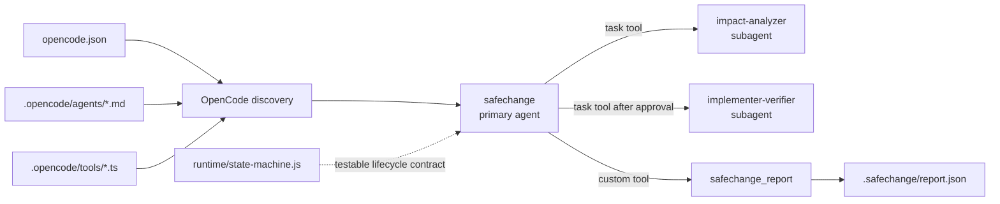

# OpenCode SafeChange

[](https://github.com/Apricooooot/opencode-safechange/actions/workflows/ci.yml)

A risk-aware multi-agent runtime for dependency upgrades, public API changes,
schema migrations, and cross-module refactors.

SafeChange focuses on the hard part of repository change: discovering what can
break, bounding the implementation, and producing evidence that the result was
verified.

## Why SafeChange?

General coding agents optimize for producing a patch. SafeChange uses an explicit
lifecycle and permission-separated agents to answer four different questions:

1. What is affected?
2. In what order should it change?
3. What is the smallest safe implementation?
4. What evidence shows that it works?

## Architecture at a glance

- `safechange`: primary agent and lifecycle orchestrator
- `impact-analyzer`: read-only repository mapper and impact investigator
- `implementer-verifier`: scoped editor and test runner
- `safechange_report`: custom tool that writes an auditable JSON report
- deterministic state machine with tests

See [ARCHITECTURE.md](ARCHITECTURE.md) for the full design.

## How this maps to OpenCode

SafeChange uses OpenCode's native runtime extension points instead of wrapping
OpenCode in a separate orchestration service.



### Discovery and configuration

At startup, OpenCode reads [`opencode.json`](opencode.json), discovers Markdown
agents from `.opencode/agents/`, and loads TypeScript tools from
`.opencode/tools/`. The Markdown filename becomes the agent name. Setting
`default_agent` to `safechange` makes the orchestrator the initial primary agent.

SafeChange deliberately leaves the model unspecified. OpenCode therefore uses
the user's configured provider and model rather than coupling this repository to
one vendor.

### Primary agent and subagent sessions

`safechange` runs as a `primary` agent and owns user interaction and lifecycle
decisions. The other two agents use `mode: subagent`. The primary agent invokes
them through OpenCode's `task` tool, which creates child sessions with their own
prompts, context windows, and permissions.

Task access is allowlisted:

```yaml
permission:
  task:
    "*": deny
    "impact-analyzer": allow
    "implementer-verifier": allow
```

This prevents the orchestrator from delegating to arbitrary installed agents.
The analyzer cannot recursively delegate because its own `task` permission is
denied.

### Permission boundaries

OpenCode evaluates tool permissions per agent. SafeChange uses this as a
capability boundary:

| Capability | Primary | Analyzer | Implementer/verifier |
| --- | --- | --- | --- |
| Read, search, LSP | Allow | Allow | Allow |
| Edit files | Ask | Deny | Allow |
| Run shell commands | Ask | Read-only Git allowlist | Ask |
| Invoke subagents | Bundled agents only | Deny | Deny |
| External directories | Deny | Deny | Deny |

These permissions reduce accidental authority, but they are not an operating
system sandbox. Shell commands and implementation still require human review.

### Custom tool execution

[`safechange-report.ts`](.opencode/tools/safechange-report.ts) uses
`@opencode-ai/plugin` to register a typed tool. OpenCode validates its arguments
before execution and supplies runtime context such as `agent`, `sessionID`, and
`worktree`. The tool writes a structured report inside the active worktree so an
agent run can be audited or evaluated later.

### Deterministic control layer

Prompts describe policy, but important ordering constraints also exist as normal
code in [`runtime/state-machine.js`](runtime/state-machine.js). The state machine
rejects invalid transitions—for example, entering `APPLYING` before `PLANNED`—
and is covered by deterministic unit tests. In version 0.1 it acts as an
executable lifecycle contract; a future plugin can enforce the same transitions
directly through OpenCode event hooks.

## Install

Prerequisites:

- OpenCode
- Node.js 20 or newer for the deterministic runtime tests

Copy these project components into the repository you want to analyze:

```text
.opencode/
opencode.json
```

Alternatively, clone SafeChange and use it as a reference configuration.
OpenCode discovers project agents from `.opencode/agents/` and tools from
`.opencode/tools/`.

## Usage

Start OpenCode in the target repository and select the `safechange` primary
agent. Begin with a read-only request:

```text
Analyze upgrading pydantic from v1 to v2. Find affected code, tests,
configuration, CI, and documentation. Produce a migration and rollback plan.
Do not edit files.
```

Review the evidence and plan. If it is correct, explicitly approve application:

```text
Apply the approved plan, run the proposed checks, inspect the diff, and write
the final SafeChange report.
```

The structured report is written to `.safechange/report.json` and is ignored by
Git by default.

More prompts are available in [`examples/`](examples/).

## Reproducible benchmark

The repository includes a small but cross-layer JavaScript fixture. Its task is
to replace a path-only configuration API with an options object while preserving
compatibility. The expected impact surface includes production callers, tests,
documentation, and an indirect cache-key dependency.

Score a SafeChange prediction with:

```bash
npm run benchmark
```

To evaluate an agent run, save its findings in the same format as
[`benchmark/sample-prediction.json`](benchmark/sample-prediction.json), then run:

```bash
node benchmark/evaluate.js path/to/prediction.json
```

The evaluator reports precision, recall, F1, classification accuracy, evidence
coverage, and a weighted overall score. See
[`benchmark/README.md`](benchmark/README.md) for the protocol.

For a real OpenCode run that cannot see the answer key:

```powershell
npm.cmd run benchmark:prepare
powershell -ExecutionPolicy Bypass -File benchmark/run-opencode.ps1 `
  -Model openai/gpt-5.6-sol -Variant high
```

The runner injects a benchmark-only structured prediction tool into the
isolated worktree, saves raw events and reproducibility metadata, and
automatically evaluates the submitted prediction.

## Lifecycle

```text
INTAKE -> ANALYZING -> PLANNED -> APPLYING -> VERIFYING -> COMPLETED
                  \          \          \              \
                   -------------------------------------> FAILED
```

Analysis-only runs can complete from `PLANNED`. Implementation cannot begin
before analysis and planning.

## Validate the runtime

```bash
npm run check
```

The tests use Node's built-in test runner and require no package installation.

## Current scope

Version 0.1 is intentionally small:

- evidence-backed impact analysis;
- approval-gated implementation;
- focused and repository-level verification;
- machine-readable reports;
- explicit lifecycle tests.

Planned work includes additional language fixtures, report schema validation,
runtime hook enforcement, and cross-model evaluation results.

## Safety

SafeChange is a control pattern, not a security sandbox. Use it on a branch or
disposable worktree and review every diff. See [SECURITY.md](SECURITY.md).

## License

MIT
